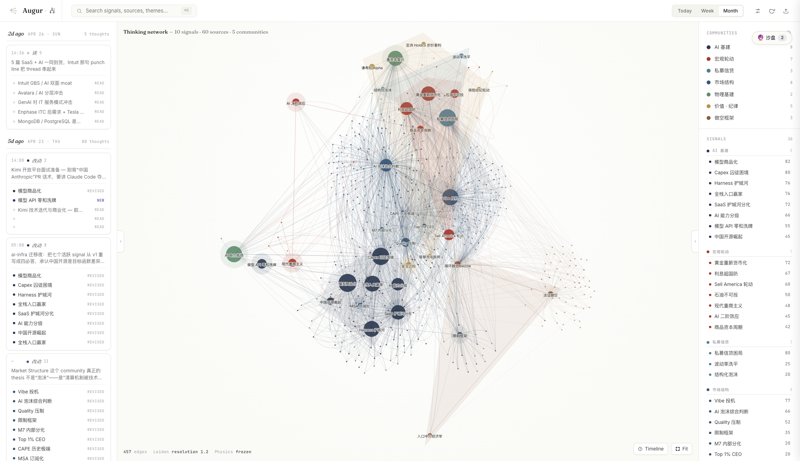
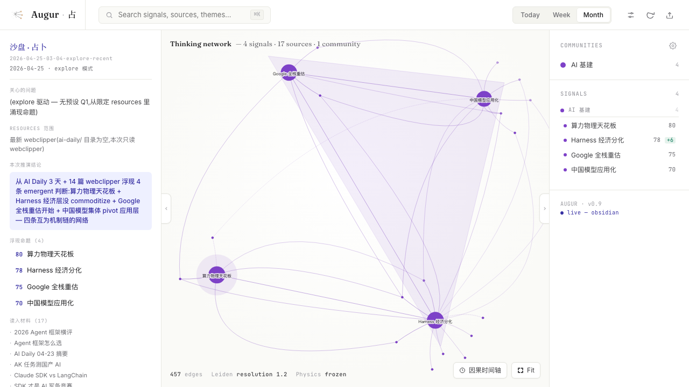

# Augur · 占

**Supervised Thinking interface for observing and replaying how AI organizes knowledge across sessions.**

当 AI 使信息输出变得廉价，我们需要一种新的和 AI 交互的方式：不是继续索要更多答案，而是监督 AI 如何组织思考。我把它叫做 **Supervised Thinking**。

<p align="center">
  
</p>

## 中文

### 核心理念

LLM Wiki 类的知识图谱尝试，给了 LLM 一个完整的知识吞吐机制：原始材料可以被读取、重写、链接，并跨 session 累积。

但如果 LLM 的输出要真正对人产生更大的帮助，我们还需要另一层东西：**观测 LLM 的思考组织方式**。

Augur 的出发点是：解决方案不应当为了可读性牺牲信息密度，而应该通过 **schema 和 UI 设计**，把模型的思维机制本身传达出来：

- 它看见了什么
- 它把什么连接在一起
- 它忽略了什么
- 哪些线索互相强化
- 哪些判断出现矛盾
- 一个判断如何跨 session 更新

这就是 **Supervised Thinking**：让人不是只读 AI 的最终回答，而是能够监督 AI 如何把知识组织成判断。

### 为什么叫 Augur

Augur 的名字来自古代星图占卜：从分散的迹象中读出结构。

在这个项目里，迹象不是星星，而是 source material、模型观察、语义聚类、signal、矛盾关系和跨 session 的判断更新。Augur 是一台可回放的思考机器：它把 LLM Wiki 的知识吞吐，推进到一个可以被人观察和监督的 reasoning layer。

### 为什么不是普通 Graph

Obsidian graph 和常见 graphify 方案通常解决的是导航问题：文件之间有没有链接，节点之间有没有边。

Augur 关心的不是“图好不好看”，而是 **节点关系是否有语义含义**。

它把语义理解做进图谱底层：

- 用 schema 定义 source / signal / evidence / contradiction / update
- 用 LLM 编译原始材料，而不是把材料停留在 chunk 层
- 用 embedding 向量参与节点布局和语义邻近关系
- 用 UI 呈现推理脉络，而不是只呈现链接拓扑
- 用 replay 机制展示判断如何一步步浮现

目标不是 prettier graph，而是 cross-session chain of thought 的可视化监督界面。

### 产品截图

#### Brand System

<p align="center">
  
</p>

#### Thinking Network

<p align="center">
  
</p>

主界面把 source、signal、community 和 evidence relation 放在同一个 reasoning graph 中。右侧不是普通目录，而是当前 reasoning state 的可检查索引；左侧是跨 session 的 thought feed。

#### Sandbox / Replay Mode

<p align="center">
  
</p>

沙盘模式用于限定问题、限定材料，然后回放一次完整的 reasoning run。它让 AI 的输出从“最终文本”变成“可检查的思考过程”。

### 系统结构

```text
.
├── .claude/skills/              # Agent workflows / 思考工作流
├── tools/                       # Local CLI utilities / 本地工具
├── investor-wiki/SCHEMA.md      # Reasoning schema / 思维图谱结构
└── investor-wiki/wiki/augur/    # Augur graph UI source / 可视化界面
```

### 三层架构

1. **Knowledge Throughput / 知识吞吐**  
   原始材料先被编译成结构化 source，而不是停留在一堆不可维护的 chunk 里。

2. **Reasoning Schema / 思维结构**  
   系统区分 facts、views、gaps、signals、evidence links、contradictions、conviction、deadline 和 kill criteria。

3. **Visual Supervision / 可视化监督**  
   UI 让人检查模型如何组织知识、形成判断、连接证据、暴露矛盾，而不是只消费最终答案。

### 当前实现

当前版本把投资研究作为第一个测试域，因为这个场景天然要求证据、矛盾、时间窗口、置信度和决策质量。但 Augur 的核心问题不局限在金融：

> 如何让人监督 AI 在一个不断增长的知识系统里组织思考？

这个问题同样适用于战略研究、产品研究、法律研究、医学研究、技术调研和任何长周期知识工作。

## English

### What Is Augur

Augur is a **Supervised Thinking** interface.

It is built around a simple thesis: when AI makes information output cheap, humans need a better way to supervise how AI organizes thought.

LLM Wiki systems give models a knowledge throughput mechanism. They let raw material be read, rewritten, linked, and accumulated across sessions. Augur adds a visual reasoning layer on top: a way to inspect what the model noticed, connected, ignored, contradicted, and updated.

### The Problem

Most AI interfaces expose only the final answer. That is not enough for high-density knowledge work.

If a model is reading hundreds of sources and producing judgments across sessions, the important question is not only “what did it answer?” The important questions are:

- What evidence did it promote?
- What did it treat as a signal?
- What contradicted the signal?
- Which assumptions are shared across judgments?
- How did the reasoning path change over time?

Augur makes those questions visible.

### The Design Principle

The solution should not reduce information density for readability. It should preserve density while making reasoning legible through schema and UI.

Augur combines:

- LLM Wiki-style knowledge compilation
- schema-defined node and edge types
- source filtering and signal promotion
- embedding-based semantic layout
- replayable reasoning updates
- a graph UI for supervising cross-session thought

### Privacy Boundary

This repository publishes the framework, schema, tools, and UI shell. It does not publish the private knowledge base, source material, generated graph data, or personal research notes.

That boundary is intentional: **Supervised Thinking is the system design; the private database is only one instantiation of it.**

### Local Preview

The public repo includes the Augur UI source. Private generated graph data is excluded.

When local graph data is present:

```bash
cd investor-wiki/wiki
python3 -m http.server 8769 --bind 127.0.0.1
```

Open:

```text
http://127.0.0.1:8769/augur/index.html
```
